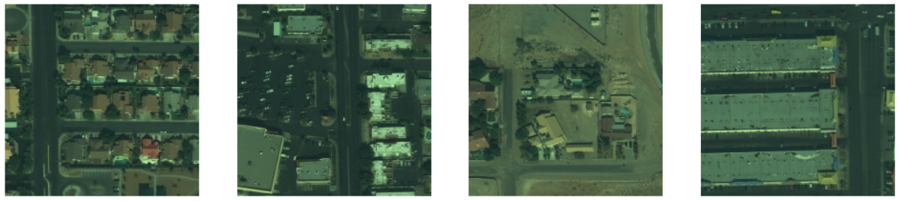

# Vertex Aided Building Polygonization

This repository contains an implementation of the paper ["Vertex Aided Building Polygonization from Satellite Imagery Applying Deep Learning"](https://elib.dlr.de/195245/1/Vertex_Aided_Building_Polygonization_from_Satellite_Imagery_Applying_Deep_Learning.pdf). The goal of this project is to accurately extract building polygons from satellite imagery, leveraging a deep learning approach.

## Description

This project implements a two-stage deep learning-based method for extracting building polygons:

**Stage 1:** Predict building segments and vertices using a double-branched network.

**Stage 2:** Perform vertex-aided building vectorization using segmentation and Gaussian density maps.

The workflow simplifies model complexity while delivering high accuracy in processing satellite imagery with multiple buildings.

Here's the model representation :

 

Where :

**-** The backbone is **ResNet34**-Like **U-Net** architecture.

**-** The **TSD** map is the Trancated Signed Distance which determine how far a pixel from a building and if its in or outside the building.

**-** The **Gaussian density** map is a represntation of the vertix of the building

## Requirements

Python 3.8+

PyTorch

NumPy

OpenCV

Matplotlib

scikit-learn

tqdm

## Dataset

The implementation utilizes the dataset from the [SpaceNet Building Detection Challenge V2](https://spacenet.ai/spacenet-buildings-dataset-v2/). This dataset includes high-resolution satellite imagery and corresponding building footprints.

Here's some Images from the dataset: 

The data is hosted on AWS as a Public Dataset. It is free to download, but an AWS account is required 
## Results

_The model achieves:_

High-quality building polygonization.

Improved performance through vertex-assisted post-processing.
